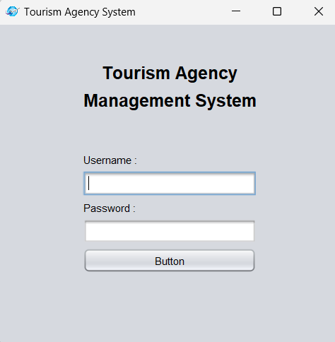

<h1 align="center">Turizm Acentesi Yönetim Sistemi</h1>
<h3 align="center">Turizm sektöründe faaliyet gösteren işletmeler için rezervasyon sistemi</h3>  

<br/>

<p align="center"> 
  
</p>

<!-- TABLE OF CONTENTS -->
<h2 id="table-of-contents"> :book: İçerik</h2>

<details open="open">
  <summary>İçerik</summary>
  <ol>
    <li><a href="#proje-ozeti"> ➤ Proje Özeti</a></li>
    <li><a href="#teknolojiler"> ➤ Kullanılan Teknolojiler</a></li>
    <li><a href="#kurulum"> ➤ Kurulum ve Başlatma</a></li>
    <li><a href="#kullanici-yonetimi"> ➤ Kullanıcı Yönetimi</a></li>
    <li><a href="#otel-yonetimi"> ➤ Otel Yönetimi</a></li>
    <li><a href="#oda-yonetimi"> ➤ Oda Yönetimi</a></li>
    <li><a href="#rezervasyon-islemleri"> ➤ Rezervasyon İşlemleri</a></li>
    <li><a href="#sistem-gorselleri"> ➤ Program İçi Görseller</a></li>
    <li><a href="#iletisim"> ➤ İletişim</a></li>
  </ol>
</details>


<!-- VİDEO -->
<h2 id="proje-ozeti-video-kaydı"> :video_camera: Proje Özeti Video Kaydı</h2>

<p>
✤ <a href="https://www.youtube.com/channel/UCEJ2dE8VjikdFug6d26wDBA">Video Linki</a> <br>
</p>


<!-- PROJECT OVERVIEW -->
<h2 id="proje-ozeti"> :mag_right: Proje Özeti</h2>

<p align="justify"> 
Patika Turizm Acentesi'nin yeni yönetim sistemi, turizm sektöründe faaliyet gösteren işletmelerin günlük operasyonlarını daha verimli hale getirmeyi hedefliyor. Sistem, otel rezervasyon süreçlerini optimize ederek, acentenin müşteri taleplerine hızlı ve etkili bir şekilde yanıt vermesine olanak tanıyor. Hem yönetici hem de acente çalışanı olmak üzere iki farklı kullanıcı profili bulunuyor ve her bir kullanıcı tipinin sistem üzerinde belirli yetkileri var.

Patika Turizm Acentesi'nin yönetim sistemi, otel ve oda yönetimi, dönemsel fiyatlandırma ayarları, oda arama ve rezervasyon işlemleri gibi temel işlevleri dijital ortamda sağlayarak, acentenin işlerini kolaylaştırıyor ve operasyonel süreçlerini daha etkin bir şekilde yönetmelerine olanak sağlıyor.
</p>


<!-- USED TECHNOLOGIES -->
<h2 id="teknolojiler"> :computer: Kullanılan Teknolojiler</h2>

<p align="justify"> 
Projede kullanılan teknolojiler:

[](https://www.python.org/) <br>
[](https://www.python.org/) <br>
[](https://www.python.org/) <br>

</p>


<!-- SETUP AND LAUNCH -->
<h2 id="kurulum"> :hammer: Kurulum ve Başlatma</h2>

<p align="justify"> 
Projeyi  klonlamak ve çalıştırmak için aşağıdaki adımları takip edin:

```bash
git clone https://github.com/behcetmuhammed/tourism-agency-system-gp.git
cd tourism-agency-system-gp
```

Projeyi IDE'nizde açın ve `App` sınıfını çalıştırın.
</p>


<!-- USER MANAGEMENT -->
<h2 id="kullanici-yonetimi"> :busts_in_silhouette: Kullanıcı Yönetimi</h2>

<p align="justify">
Sistemde iki farklı kullanıcı tipi bulunmaktadır: Admin ve Acente Çalışanı. Admin kullanıcıları, sistem üzerinde kapsamlı kontrol ve yönetim yetkilerine sahiptir. Bu yetkiler arasında acente çalışanlarını listeleme, ekleme, silme, güncelleme ve kullanıcı rollerine göre filtreleme işlemleri yer alır. Acente çalışanları ise otel ve oda yönetimi, dönem yönetimi, fiyat yönetimi gibi işlevlere erişim sağlar ve müşteri rezervasyonları üzerinde işlemler gerçekleştirebilir.
</p>


<!-- HOTEL MANAGEMENT -->
<h2 id="otel-yonetimi"> :hotel: Otel Yönetimi</h2>

<p align="justify">
Otel Yönetimi, Patika Turizm Acentesi'nin anlaşmalı olduğu otelleri yönetmek için tasarlanmıştır. Acente çalışanları bu modül aracılığıyla otel listeleme ve yeni otel ekleme işlemlerini gerçekleştirebilir. Her otel kaydında, otelin adı, adresi, e-posta adresi, telefon numarası, yıldız sayısı ve otelin sahip olduğu tesis özellikleri gibi detaylar yer alır. Ayrıca, otellere ait pansiyon tipleri ve dönem bilgileri de bu modül üzerinden yönetilir, böylece fiyatlandırma ve rezervasyon işlemleri için gerekli altyapı sağlanmış olur.
</p>


<!-- ROOM MANAGEMENT -->
<h2 id="oda-yonetimi"> :door: Oda Yönetimi</h2>

<p align="justify">
Oda Yönetimi, acente çalışanlarının oteller bünyesindeki odaları yönetebilmelerini sağlar. Bu modül aracılığıyla oda listeleme, yeni oda ekleme ve odaları otel adı, şehir ya da istenilen tarihe göre arama imkanı sunar. Oda kaydı sırasında, odanın tipi (tek kişilik, çift kişilik, suite vb.), oda özellikleri (yatak sayısı, televizyon, minibar, oyun konsolu vb.), oda fiyatı ve oda stoğu gibi bilgiler girilir.


<!-- RESERVATION OPERATIONS -->
<h2 id="rezervasyon-islemleri"> :clipboard: Rezervasyon İşlemleri</h2>

<p align="justify">
Rezervasyon İşlemleri, acente çalışanlarının müşterilere hızlı ve etkili bir şekilde hizmet sunmalarını sağlar. Rezervasyon işlemi sırasında, müşteri iletişim bilgileri ve misafir bilgileri girilir. Bu bilgilere göre toplam fiyat otomatik olarak hesaplanır. Acente çalışanları rezervasyonları listeleyebilir, güncelleyebilir ve silebilirler. Bir rezervasyon işlemi tamamlandığında, ilgili odanın stoğu 1 azaltılır.
</p>


<!-- PROGRAM SCREENSHOTS -->
<h2 id="sistem-gorselleri"> :camera: Program İçi Görseller</h2>

<p align="justify"> 

### Login Ekranı
1)


### Admin Paneli 
1)

2)


### Otel Yönetimi
1)

2)


### Pansiyon Yönetimi
1)


### Sezon Yönetimi
1)


### Oda Yönetimi
1)

2)


### Rezervasyon İşlemleri
1)

2)


### Validasyonlar
1)

2)

3)


</p>


<!-- CONTACT -->
<h2 id="iletisim"> :phone: İletişim ve Bilgiler</h2>

<p>
✤ <a href="https://linkedin.com/in/esra-sen">LinkedIn</a> <br>
✤ <a href="https://github.com/esrasen">GitHub</a> <br>
</p>
