<h1 align="center">Turizm Acentesi Yönetim Sistemi</h1>
<h3 align="center">Turizm sektöründe faaliyet gösteren işletmeler için rezervasyon sistemi</h3>  

<br/>

<p align="center"> 
  
</p>

<!-- TABLE OF CONTENTS -->
<h2 id="table-of-contents"> :book: İçerik</h2>

<details open="open">
  <summary>İçerik</summary>
  <ol>
    <li><a href="#proje-ozeti"> ➤ Proje Özeti</a></li>
    <li><a href="#teknolojiler"> ➤ Kullanılan Teknolojiler</a></li>
    <li><a href="#kurulum"> ➤ Kurulum ve Başlatma</a></li>
    <li><a href="#kullanici-yonetimi"> ➤ Kullanıcı Yönetimi</a></li>
    <li><a href="#otel-yonetimi"> ➤ Otel Yönetimi</a></li>
    <li><a href="#oda-yonetimi"> ➤ Oda Yönetimi</a></li>
    <li><a href="#rezervasyon-islemleri"> ➤ Rezervasyon İşlemleri</a></li>
    <li><a href="#sistem-gorselleri"> ➤ Program İçi Görseller</a></li>
    <li><a href="#iletisim"> ➤ İletişim</a></li>
  </ol>
</details>


<!-- VİDEO -->
<h2 id="proje-ozeti-video-kaydı"> :video_camera: Proje Özeti Video Kaydı</h2>

<p>
✤ <a href="https://www.youtube.com/channel/UCEJ2dE8VjikdFug6d26wDBA">Video Linki</a> <br>
</p>


<!-- PROJECT OVERVIEW -->
<h2 id="proje-ozeti"> :mag_right: Proje Özeti</h2>

<p align="justify"> 
Patika Turizm Acentesi'nin yeni yönetim sistemi, turizm sektöründe faaliyet gösteren işletmelerin günlük operasyonlarını daha verimli hale getirmeyi hedefliyor. Sistem, otel rezervasyon süreçlerini optimize ederek, acentenin müşteri taleplerine hızlı ve etkili bir şekilde yanıt vermesine olanak tanıyor. Hem yönetici hem de acente çalışanı olmak üzere iki farklı kullanıcı profili bulunuyor ve her bir kullanıcı tipinin sistem üzerinde belirli yetkileri var.
Patika Turizm Acentesi'nin yönetim sistemi, otel ve oda yönetimi, dönemsel fiyatlandırma ayarları, oda arama ve rezervasyon işlemleri gibi temel işlevleri dijital ortamda sağlayarak, acentenin işlerini kolaylaştırıyor ve operasyonel süreçlerini daha etkin bir şekilde yönetmelerine olanak sağlıyor.
</p>


<!-- USED TECHNOLOGIES -->
<h2 id="teknolojiler"> :computer: Kullanılan Teknolojiler</h2>

<p align="justify"> 
Projede kullanılan teknolojiler:

[](https://www.java.com/tr/) <br>
[](https://www.java.com/tr/) <br>
[](https://www.mysql.com/) <br>
[](https://www.python.org/) <br>

</p>


<!-- SETUP AND LAUNCH -->
<h2 id="kurulum"> :hammer: Kurulum ve Başlatma</h2>

<p align="justify"> 
Projeyi  klonlamak ve çalıştırmak için aşağıdaki adımları takip edin:

```bash
git clone https://github.com/behcetmuhammed/tourism-agency-system-gp.git
cd tourism-agency-system-gp
```

Projeyi IDE'nizde açın ve `App` sınıfını çalıştırın.
</p>


<!-- USER MANAGEMENT -->
<h2 id="kullanici-yonetimi"> :busts_in_silhouette: Kullanıcı Yönetimi</h2>

<p align="justify">
Sistemde iki ana kullanıcı türü bulunur: Yönetici ve Acenta Çalışanı. Yönetici kullanıcıları, sistem üzerinde geniş yetkilere sahiptirler ve acenta çalışanlarını listeleme, ekleme, silme, güncelleme gibi işlemleri gerçekleştirebilirler. Ayrıca, kullanıcıları rollerine göre filtreleyebilirler. Acenta çalışanları ise otel ve oda yönetimi, dönem yönetimi ve fiyat yönetimi gibi işlevlere erişerek müşteri rezervasyonları üzerinde işlem yapabilirler.
</p>


<!-- HOTEL MANAGEMENT -->
<h2 id="otel-yonetimi"> :hotel: Otel Yönetimi</h2>

<p align="justify">
Patika Turizm Acentesi'nin anlaşmalı olduğu otellerin yönetimi için tasarlanmış olan Otel Yönetimi modülü, acenta çalışanlarının otel listeleme ve yeni otel ekleme işlemlerini gerçekleştirmesini sağlar. Her otel kaydında otelin adı, adresi, e-posta adresi, telefon numarası, yıldız sayısı ve otelin sunduğu tesis özellikleri gibi bilgiler bulunur. Ayrıca, otellere ait pansiyon tipleri ve dönem bilgileri de bu modül üzerinden yönetilerek fiyatlandırma ve rezervasyon süreçleri için gerekli altyapı oluşturulur.
</p>


<!-- ROOM MANAGEMENT -->
<h2 id="oda-yonetimi"> :door: Oda Yönetimi</h2>

<p align="justify">
Oda Yönetimi modülü, acenta çalışanlarının otellerdeki odaları yönetmelerini sağlar. Bu modül sayesinde odaların listelenmesi, yeni odaların eklenmesi ve odaların otel adı, şehir veya belirli bir tarihe göre aranması mümkündür. Oda kaydı sırasında, odanın tipi (tek kişilik, çift kişilik, suit vb.), oda özellikleri (yatak sayısı, televizyon, minibar, oyun konsolu vb.), oda fiyatı ve oda stoğu gibi bilgiler girilir.


<!-- RESERVATION OPERATIONS -->
<h2 id="rezervasyon-islemleri"> :clipboard: Rezervasyon İşlemleri</h2>

<p align="justify">
Rezervasyon İşlemleri modülü, acenta çalışanlarının müşteri hizmetlerini hızlı ve etkili bir şekilde sunmalarını sağlar. Rezervasyon yapılırken müşteri iletişim bilgileri ve misafir bilgileri sisteme girilir. Bu bilgilere göre toplam fiyat otomatik olarak hesaplanır. Acenta çalışanları rezervasyonları listeleyebilir, güncelleyebilir ve silebilirler. Rezervasyon tamamlandığında, ilgili odanın stoğu otomatik olarak bir azalır.
</p>


<!-- PROGRAM SCREENSHOTS -->
<h2 id="sistem-gorselleri"> :camera: Program İçi Görseller</h2>

<p align="justify"> 

### Login Ekranı

<p>
Kullanıcı adı ve şifre girildikten sonra, sistem tarafından aşağıdaki şekilde yönlendirilirsiniz:
  
- Eğer admin kullanıcı adı ve şifresi girildiyse, **Admin Paneli** ne giriş yapılır.
- Eğer çalışan kullanıcı adı ve şifresi girildiyse, **Çalışan Paneli**ne giriş yapılır.
</p>

1)


### Admin Paneli 
<p>Admin ve Çalışan Listesi:</p>

1)
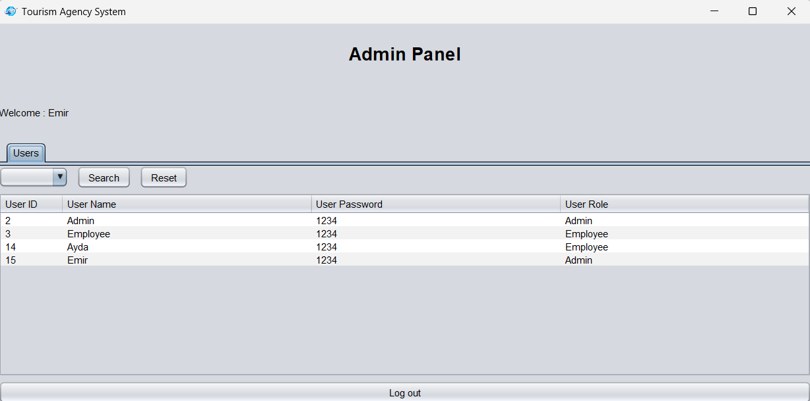

<p>
  Yeni kullanıcı eklemek, mevcut kullanıcıyı güncellemek veya silmek için:
  
- İşlem yapmak istediğiniz kullanıcıyı seçmek için kullanıcı satırına sağ veya sol tıklayın.
- Açılan pop-up menüden ilgili işlemi (Ekle, Güncelle veya Sil) seçin.
</p>

2)
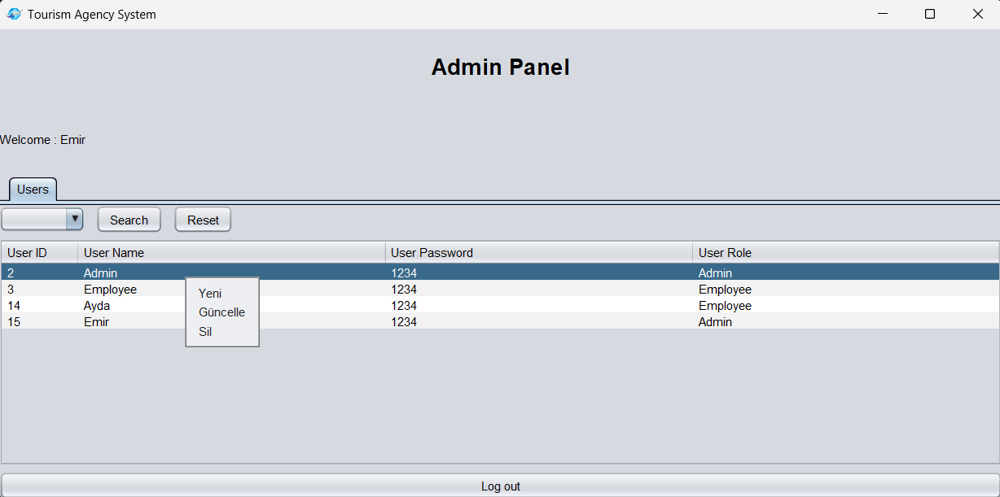

<p>
Yeni kullanıcı ekleme paneli
</p>

3)
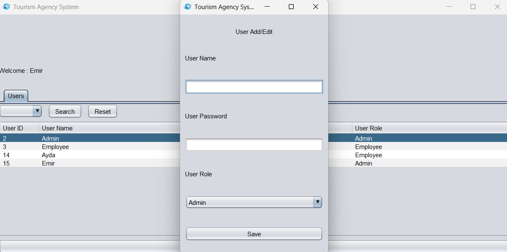

### Otel Yönetimi
1)
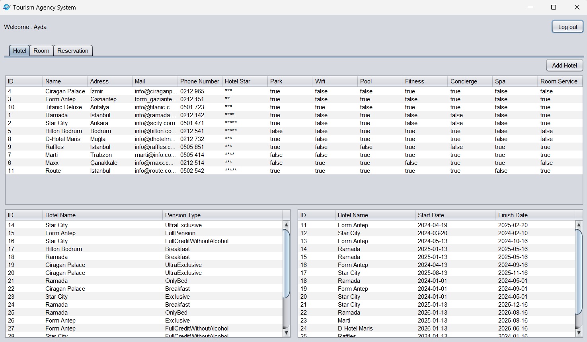

2)
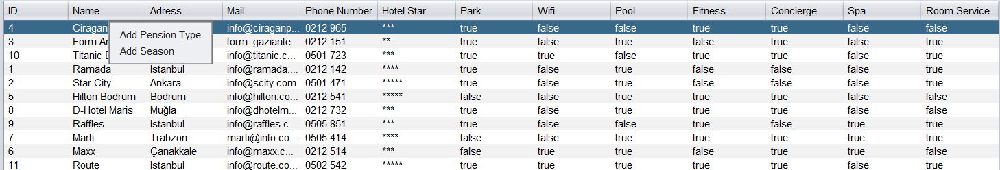

3)
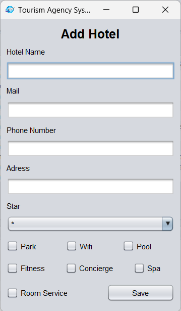

### Pansiyon Yönetimi
1)


### Sezon Yönetimi
1)
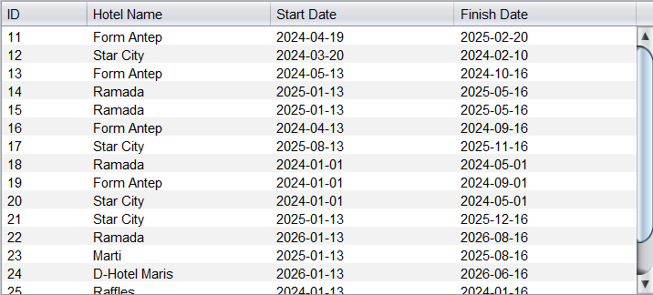

### Oda Yönetimi
1)
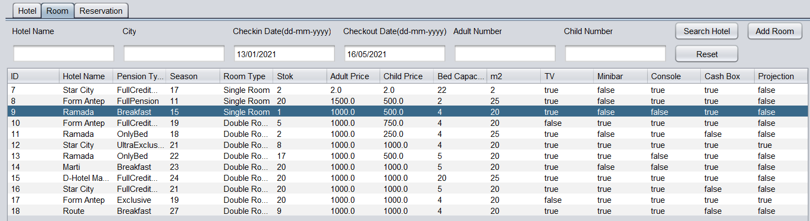

### Rezervasyon İşlemleri
1)
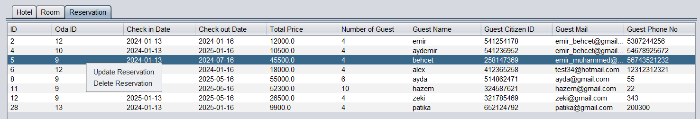

### Validasyonlar
1)
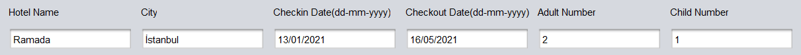

2)
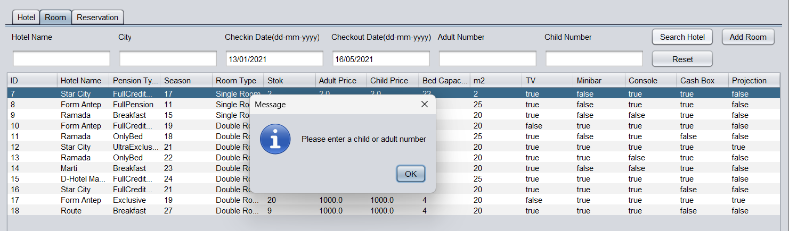

</p>


<!-- CONTACT -->
<h2 id="iletisim"> :phone: İletişim ve Bilgiler</h2>

<p>
✤ <a href="https://www.linkedin.com/in/emir-muhammed/">LinkedIn</a> <br>
✤ <a href="https://github.com/behcetmuhammed">GitHub</a> <br>
</p>
